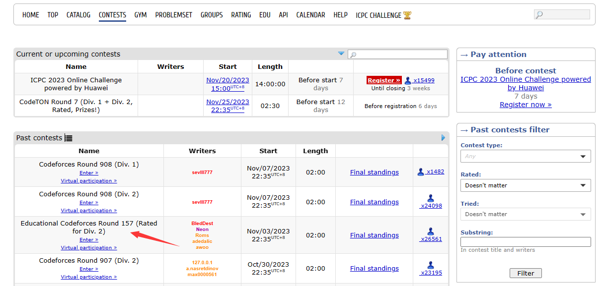
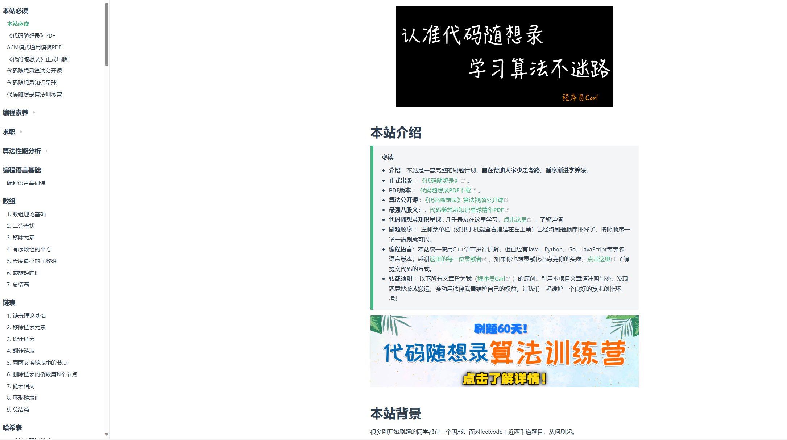

## 引言
众所周知，算法题在程序员的笔试和面试中都是非常常见的。

相信很多人都想做到笔试AK，面试能轻松手撕算法，但算法是一个长期积累的过程，所以提前准备非常重要。在这里，推荐大家几个常用网站，分别是[leetcode](https://leetcode.cn/contest/) 和 [codeforces](https://codeforces.com/contests) .

前者是为了面试AK，后者是为了笔试AK。（一般而言，大厂的算法题笔试难度>面试难度）

普通学生，可以参加**leetcode**的周赛，竞赛积分刷到**2200+**，大厂面试这关基本没啥问题。

有余力的同学，可以参加**codeforces**的比赛，竞赛积分刷到**1800+**，大厂笔试这关基本没啥问题。

## leetcode
> 一个小Tips：可以去牛客网玩玩ACM模式的题目，自己处理输入输出，leetcode一般提供函数接口，不需要自己处理输入输出。

### 入门算法
如果要建立对算法的整体架构，我的建议是边刷题边学习。
前期可以对着工大校友的[代码随想录](https://programmercarl.com/)刷题，过一遍基础。
掌握基础的数据结构，如数组，链表，栈，队列，二叉树，图（熟练使用map）。
基础的算法，如：双指针，分治，贪心，动态规划，dfs和bfs，回溯，简单图论。

### 入门周赛
我推荐[灵茶山艾府](https://leetcode.cn/circle/discuss/WR1MJP/)，同时他的[bilibili](https://space.bilibili.com/206214?spm_id_from=333.337.0.0)频道也开了，大家可以关注一波。
从算法基础->周赛，大概花个两个月的时间就ok。

### 火速入门
如果不想按照路线去刷题，只想快速获得一个比较好的面试成绩。
推荐[剑指offer](https://leetcode.cn/study-plan/lcof/)和[HOT100](https://leetcode.cn/problem-list/2cktkvj/)。跟着[K佬](https://leetcode.cn/u/jyd/)把一些精妙的解法记住即可。
推荐一波K佬写的算法网站：[https://www.hello-algo.com/](https://www.hello-algo.com/)
## codeforces
这个平台是用来突破T4，笔试拿高分准备的，但打比赛的时间比较晚。
如果自己不想打，也可以关注一个[UP主](https://space.bilibili.com/2073420539/?spm_id_from=333.999.0.0)，看看别人打。
另外，再推荐一下Atcoder，里面的ABC也适合提高。

## 结束语
刷算法题可以培养成爱好，有时候比较迷茫，不知道干啥的时候，可以刷刷算法题来打磨时间。

同时，算法好!=编程好，编程需要大量的实践，需要debug和工程管理能力以及更强的抽象能力。

你需要快速学习和掌握生产力工具，学会分析问题和解决问题。推荐大家平时多逛逛github。

编程是程序员的基本功，不管是走向开发岗 or 算法岗，参加工作的前几年都需要写大量的代码。

篇幅较少，给不了大家太多的建议，自己也是在摸爬滚打，被虐菜中（orz）。

最后的最后，怎么能少得了chatGPT,推荐一个网站：[https://www.forefront.ai/](https://www.forefront.ai/)

祝大家学习愉快！！！

